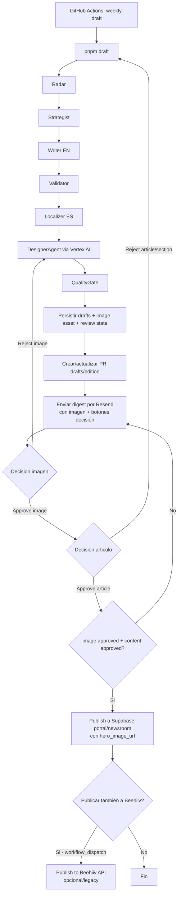

# Plan de trabajo: imagen conceptual y rechazo de drafts desde email

Fecha: 2026-06-04  
Proyecto: `agentic_newsletter_testing`  
Alcance: flujo automatizado `weekly draft` de The Transformation Letter

---

## 1. Resumen ejecutivo

Este documento propone el plan de trabajo para integrar dos capacidades al flujo semanal de generación de newsletters:

1. Generacion y aprobacion de una imagen conceptual por articulo, integrada al flujo `weekly draft`, adjunta o visible en el correo de revision, y bloqueante para la publicacion hasta que el aprobador la apruebe.
2. Rechazo del articulo completo o de secciones especificas desde el correo de revision, con reactivacion del flujo de generacion de contenido y reinicio del ciclo draft -> imagen -> revision.

El proyecto ya contiene un `DesignerAgent` funcional en `src/agents/designer.ts`. Ese agente compone un prompt con Claude, genera un hero image mediante Gemini (`GEMINI_API_KEY`), produce alt text/caption bilingue, y guarda artefactos en `drafts/`. Por lo tanto, no corresponde crear un agente de imagen desde cero. La implementacion recomendada es evolucionar ese agente para usar Vertex AI como proveedor base, conservar su contrato de entrada/salida y conectarlo de forma formal al ciclo de aprobacion.

El sistema tambien ya contiene una compuerta de aprobacion por email: `src/scripts/send-draft-digest.ts` genera el digest por Resend y `portal/app/approve/route.ts` verifica un token HMAC para publicar directo al portal. Actualmente la aprobacion es binaria: `approve` publica la edicion. El plan extiende ese mecanismo a un modelo de decisiones separadas: aprobar/rechazar imagen, aprobar/rechazar articulo, y rechazar secciones.

La publicacion final debe quedar bloqueada hasta que se cumplan dos condiciones persistidas y verificables: `imageStatus = approved` y `contentStatus = approved`.

---

## 2. Analisis del estado actual

### 2.1 Flujo `weekly draft`

El workflow principal esta definido en `.github/workflows/weekly-draft.yml`.

Comportamiento actual relevante:

- Se ejecuta por cron cada lunes o manualmente con `workflow_dispatch`.
- Calcula `editionId` en formato `YYYY-WW`.
- Ejecuta `pnpm draft -- --edition <id>`.
- Abre o actualiza un PR `drafts/<editionId>` con los archivos generados en `drafts/`.
- Restaura los drafts en el checkout para poder mandar el digest.
- Ejecuta `pnpm digest:edition -- --edition <id> --pr-url <url>` si Resend esta configurado.
- Adjunta el canal de revision al PR, al portal admin y/o a un link firmado de aprobacion.

El flujo CLI esta en `src/run.ts` y hoy ejecuta, en orden efectivo:

1. Radar: seleccion de fuentes.
2. Strategist: angulo editorial.
3. Writer: draft EN.
4. Validator: validacion contra Voice Bible.
5. Localizer: draft ES con voz mexicana.
6. Designer: imagen hero opcional.
7. QualityGate: fact-check, originalidad, voz, diversidad.
8. Persistencia de artefactos en `drafts/`.
9. Digest/revision por canales externos.

Nota: el comentario inicial de `src/run.ts` todavia dice `Radar -> Strategist -> Writer -> Validator -> Localizer`, pero el codigo ya incluye `DesignerAgent` y `QualityGateAgent`.

### 2.2 Agentes existentes

El proyecto declara los agentes en `src/types/enums.ts`:

- `supervisor`
- `radar`
- `strategist`
- `writer`
- `designer`
- `localizer`
- `validator`
- `qualityGate`
- `distributor`
- `amplifier`
- `analyst`

Los agentes productivos viven en `src/agents/`. Para este plan importan especialmente:

- `src/agents/designer.ts`
- `src/agents/writer.ts`
- `src/agents/localizer.ts`
- `src/agents/validator.ts`
- `src/agents/quality-gate.ts`
- `src/agents/distributor.ts`

### 2.3 Estado actual del agente de imagen

Si existe un agente de imagen: `DesignerAgent`.

Contrato actual:

- Entrada: `angle`, `enContent`, `outputDir`, `heroFilename` opcional.
- Salida: `assets[]` con `kind: "hero"`, `imagePath`, `prompt`, `altText`, `caption`, mas `imageModel`.
- Estilo: se carga desde `config/brand-style-tokens.json`.
- Prompt visual: compuesto por Claude (`claude-sonnet-4-5`).
- Imagen: generada via Gemini endpoint `https://generativelanguage.googleapis.com/v1beta/models/...:generateContent`.
- Credencial actual: `GEMINI_API_KEY`.
- Modo dry-run: si `DRY_RUN=true`, escribe un placeholder `.dryrun.txt` en lugar de llamar al proveedor.
- Artefactos actuales:
  - `drafts/<editionId>-hero.png`
  - `drafts/<editionId>-designer.json`
  - Hero embebido por referencia relativa en `drafts/<editionId>-en.html` y `drafts/<editionId>-es.html`.
  - Bloque `designer` dentro de `drafts/<editionId>-draft.json`.

Conclusion: no se debe crear otro agente paralelo. Se debe adaptar `DesignerAgent` para Vertex AI y fortalecer su rol dentro del ciclo de aprobacion.

### 2.4 Estado actual del correo de revision

El digest se genera en `src/scripts/send-draft-digest.ts`.

Capacidades actuales:

- Renderiza HTML y texto plano.
- Incluye metadata editorial, QA score, OS pillar, People dimension, headline, thesis, subject, preheader y notas del Validator.
- Incluye links a:
  - PR de GitHub.
  - Editor del portal (`/admin/drafts/<edition>/edit`) si `PORTAL_BASE_URL` esta configurado.
  - Aprobacion one-click si `APPROVAL_BASE_URL` y `APPROVAL_SIGNING_SECRET` estan configurados.
  - Workflow manual de publish como fallback.
- Envia por Resend mediante `sendViaResend`.

Limitaciones actuales:

- No renderiza ni adjunta el asset del Designer en el digest.
- No soporta attachments en `ResendPayload`.
- No tiene acciones de rechazo.
- No distingue aprobacion de imagen vs aprobacion de contenido.
- El link de aprobacion actual publica directamente si el quality gate pasa.

### 2.5 Estado actual de aprobacion y publicacion

Hay dos rutas de aprobacion coexistiendo (pero ahora portal es primaria):

1. Ruta moderna del portal: `portal/app/review/route.ts` (extensión de `approve/route.ts`)
   - Verifica `APPROVAL_SIGNING_SECRET`.
   - Decodifica token con `portal/lib/approval-token.ts`.
   - Ejecuta decisiones separadas: `image_approve`, `image_reject`, `content_approve`, `content_reject`, `section_reject`.
   - Publica directo a Supabase mediante `portal/lib/publish-edition.ts` cuando imagen + contenido están aprobados.
   - Genera `hero_image_url` en la edición publicada → aparece en newsroom.

2. Worker legado (opcional/deprecated): `workers/approval-receiver/src/index.ts`
   - Mantiene compatibilidad temporal.
   - **Ya NO es ruta principal de publicación**.
   - Si se ejecuta, solo dispara `repository_dispatch: edition_approved` → `.github/workflows/publish-to-beehiiv.yml` (distribución opcional adicional a Beehiiv).

El token actual, tanto en `src/utils/approval-token.ts` como en `portal/lib/approval-token.ts`, solo acepta `decision: "approve"`. Las pruebas del portal incluso rechazan explicitamente una decision `reject`.

Limitaciones actuales:

- No hay modelo de estado para aprobaciones parciales.
- No existe `image approved/rejected`.
- No existe `content rejected`.
- No existe rechazo por seccion.
- La publicacion puede ocurrir con un solo approve token, sin verificar aprobacion explicita de imagen.

### 2.6 Estado actual de imagen en portal/newsroom

La base del portal ya contempla `hero_image_url`:

- `portal/supabase/migrations/0005_public_editions_hero.sql` expone `hero_image_url` en la vista publica.
- `portal/components/newsroom/NewsroomHeroArticle.tsx` y `portal/app/newsroom/[editionId]/page.tsx` ya renderizan imagen si `hero_image_url` existe.
- `portal/lib/supabase/types.ts` incluye `hero_image_url`.

Pero los mapeadores actuales fijan `hero_image_url: null`:

- `src/utils/portal-sync.ts`
- `portal/lib/edition-mapping.ts`

Conclusion: falta subir el asset aprobado a almacenamiento publico/CDN y pasar su URL al mirror/publicacion.

### 2.7 Pruebas existentes relevantes

El repo ya tiene cobertura sobre las piezas a extender:

- `tests/agents/designer.test.ts`
  - Valida input/output del Designer.
  - Prueba dry-run.
  - Prueba escritura de bytes de imagen con fetch simulado.
- `tests/scripts/send-draft-digest.test.ts`
  - Verifica render de digest HTML/text.
  - Verifica CTA de aprobacion.
  - Verifica escape HTML.
  - Verifica envio por Resend.
- `tests/utils/approval-token.test.ts`
  - Verifica firma HMAC, expiracion y payloads invalidos.
- `portal/__tests__/lib/approval-token.test.ts`
  - Verifica compatibilidad del token en portal.
  - Actualmente rechaza decisiones que no sean `approve`.
- `portal/__tests__/lib/publish-edition.test.ts`
  - Verifica quality gate y lectura del draft desde GitHub.

---

## 3. Arquitectura propuesta

### 3.1 Principios de diseno

1. Reutilizar `DesignerAgent`; no crear un agente duplicado.
2. Mantener la compuerta de aprobacion en el portal como fuente principal de decisiones.
3. Persistir estado de revision por `editionId`, no inferirlo solo desde clicks de email.
4. Hacer que publish sea idempotente y bloqueante: si falta aprobacion de imagen o contenido, no publica.
5. Mantener compatibilidad con revision por PR y editor admin.
6. Diseñar tokens firmados por accion, con expiracion y nonce.
7. Separar regeneracion de imagen y regeneracion de contenido: rechazar imagen no debe regenerar el articulo; rechazar articulo si debe reiniciar el ciclo completo.

### 3.2 Flujo objetivo



### 3.3 Modelo de estado propuesto

Crear un artefacto versionado por edicion: `drafts/<editionId>-review.json`.

Estructura sugerida:

```json
{
  "editionId": "2026-21",
  "runId": "uuid",
  "reviewVersion": 1,
  "image": {
    "status": "pending",
    "attempt": 1,
    "assetPath": "drafts/2026-21-hero.png",
    "publicUrl": null,
    "prompt": "...",
    "rejectedPrompts": [],
    "approvedAt": null,
    "rejectedAt": null,
    "rejectionReason": null
  },
  "content": {
    "status": "pending",
    "attempt": 1,
    "rejectedSections": [],
    "approvedAt": null,
    "rejectedAt": null,
    "rejectionReason": null
  },
  "publish": {
    "status": "blocked",
    "blockedReason": "image_pending"
  },
  "events": []
}
```

Estados recomendados:

- Imagen: `pending`, `approved`, `rejected`, `regenerating`, `failed`.
- Contenido: `pending`, `approved`, `rejected`, `regenerating`, `failed`.
- Publish: `blocked`, `ready`, `published`, `failed`.

El archivo debe guardarse en la rama `drafts/<editionId>` junto con los demas artefactos, para que el portal pueda leerlo desde GitHub igual que hoy lee `drafts/<editionId>-draft.json`.

En una fase posterior, este estado puede migrarse a Supabase (`edition_reviews`) para tener consultas y auditoria mas comodas. Para la primera implementacion, el JSON en rama de draft reduce el cambio de infraestructura.

### 3.4 Tokens de decision

Extender el token de aprobacion actual para soportar decisiones explicitas.

Decision types propuestos:

```ts
type ReviewDecision =
  | "image_approve"
  | "image_reject"
  | "content_approve"
  | "content_reject"
  | "section_reject";
```

Payload propuesto:

```ts
interface ReviewTokenPayload {
  editionId: string;
  decision: ReviewDecision;
  sectionId?: string;
  sectionType?: "news" | "lead" | "analysis" | "spotlight" | "tool" | "quickTakes" | "cta";
  exp: number;
  nonce: string;
}
```

Cambios necesarios:

- Reemplazar `ApprovalDecision = "approve"` por un union type ampliado.
- Mantener compatibilidad temporal: `decision: "approve"` puede mapearse a `content_approve` solo durante migracion, pero la ruta nueva debe preferir decisiones explicitas.
- Agregar `buildReviewLink(baseUrl, input, secret)` en `src/utils/approval-token.ts`.
- Portar la misma verificacion a `portal/lib/approval-token.ts`.
- Actualizar pruebas de token en pipeline y portal.

### 3.5 Endpoint de decisión en portal (nuevo flujo)

Crear o extender endpoint para reemplazar el Worker legacy:

- Opcion recomendada: crear `portal/app/review/route.ts` (extensión de `/approve`).
- Mantener `portal/app/approve/route.ts` como compatibilidad para links antiguos.

Ruta objetivo:

```text
GET /review?t=<signed-token>
```

Responsabilidades:

1. Verificar token HMAC y expiracion.
2. Leer `drafts/<editionId>-review.json` desde rama `drafts/<editionId>`.
3. Validar transiciones permitidas.
4. Escribir el nuevo estado de revision en la rama de draft via GitHub Contents API.
5. Ejecutar la accion correspondiente:
   - `image_approve`: marcar imagen aprobada.
   - `image_reject`: disparar regeneracion de imagen (workflow `regenerate-image.yml`).
   - `content_approve`: **marcar contenido aprobado; si imagen ya esta aprobada, PUBLICAR A SUPABASE** (newsroom).
   - `content_reject`: disparar rerun completo de `weekly-draft` para la edicion.
   - `section_reject`: registrar secciones rechazadas y disparar rerun con instrucciones especificas.

Validacion de orden:

- `content_approve` debe fallar con mensaje claro si `image.status !== "approved"`.
- `content_reject` puede aceptarse antes o despues de imagen aprobada, pero debe reiniciar imagen porque el nuevo contenido puede requerir una imagen distinta.
- `image_reject` no debe invalidar el contenido.

**Publicación a Supabase (newsroom):** Cuando se ejecuta `content_approve` después de `image_approve`:
- Leer `drafts/<editionId>-draft.json` y `-sources.json`
- Ejecutar `publishEdition(editionId)` desde `portal/lib/publish-edition.ts`
- Usar `review.image.publicUrl` como `hero_image_url`
- Insertar edición en Supabase `editions` table
- Edición aparece en `/newsroom` con imagen

### 3.6 Regeneracion de imagen

El `DesignerAgent` debe soportar regeneracion basada en rechazo.

Cambios propuestos en input:

```ts
const DesignerInputSchema = z.object({
  angle: StrategicAngleSchema,
  enContent: LocalizedContentSchema,
  outputDir: z.string().min(1),
  heroFilename: z.string().min(1).optional(),
  attempt: z.number().int().positive().optional(),
  rejectionFeedback: z.string().optional(),
  rejectedPrompts: z.array(z.string()).optional()
});
```

Comportamiento:

- En primer intento, genera imagen como hoy.
- En rechazo, compone un prompt distinto usando:
  - contenido actual del draft,
  - prompt anterior,
  - razon de rechazo si existe,
  - lista de prompts rechazados,
  - instruccion explicita: no repetir composicion/metafora visual.
- Guardar nuevo asset con version:
  - `drafts/<editionId>-hero-v2.png`
  - `drafts/<editionId>-designer-v2.json`
- Actualizar `drafts/<editionId>-review.json` con `attempt += 1`.
- Reenviar digest o email de revision de imagen.

### 3.7 Migracion de Gemini a Vertex AI

Requerimiento: si no existiera agente, usar Vertex AI como tecnologia base. Como el agente si existe pero usa Gemini API directa, la ruta recomendada es migrar el backend de renderizado a Vertex AI sin cambiar la API externa del agente.

Cambios propuestos:

- Agregar configuracion:
  - `GOOGLE_CLOUD_PROJECT`
  - `GOOGLE_CLOUD_LOCATION`, por ejemplo `us-central1`
  - `VERTEX_IMAGE_MODEL`, por ejemplo el modelo Imagen aprobado para la cuenta.
  - `GOOGLE_APPLICATION_CREDENTIALS` local o Workload Identity / service account en GitHub Actions.
- Reemplazar `geminiApiKey` en `AppConfigSchema` / `ApiClients` por un proveedor de imagen mas generico:
  - `imageProvider: "vertex" | "gemini" | "none"`
  - `vertexProjectId`
  - `vertexLocation`
  - `vertexImageModel`
- Mantener `GEMINI_API_KEY` solo como compatibilidad temporal si se desea.
- Extraer `generateHeroImage` a un cliente dedicado:
  - `src/utils/image-generation.ts`
  - `generateImageWithVertex(input): Promise<Buffer>`
- Actualizar `config/brand-style-tokens.json` para que `imageStyle.model` apunte al modelo Vertex elegido.
- Actualizar pruebas de `DesignerAgent` para simular el cliente Vertex en lugar de acoplarse al endpoint Gemini.

### 3.8 Imagen en email de revisión

El digest debe mostrar, adjuntar y permitir decisiones sobre la imagen.

Cambios propuestos en `send-draft-digest.ts`:

- Extender `DraftJson` para incluir `designer`.
- Leer `drafts/<editionId>-designer.json` o el bloque `draft.designer`.
- Incluir bloque visual **ANTES del headline**:
  - preview de imagen (URL publica o data: URI base64),
  - caption bilingüe,
  - alt text,
  - modelo/attempt para auditoria editorial,
  - **botones**: "Aprobar imagen" y "Rechazar imagen" con tokens firmados.
- Extender `ResendPayload` con `attachments`.
- Adjuntar el PNG si existe localmente:
  - filename: `<editionId>-hero.png`
  - content: base64
  - contentType: `image/png`
- Recomendacion practica: usar tanto attachment como URL publica cuando exista. Muchos clientes de email tratan attachments e imagenes inline de forma distinta; tener fallback reduce friccion.

**Almacenamiento de imagen:** Subir candidato a Supabase Storage (`edition-assets` bucket) para que haya URL publica:
- Ruta: `edition-assets/<editionId>/hero-v<attempt>.png`
- URL devuelto se guarda en `review.json` → adjuntado en email → finalmente usado en `hero_image_url` de publicacion si se aprueba.

### 3.9 Imagen aprobada en publicación al Newsroom

Cuando la imagen esté aprobada, su URL debe viajar a la publicación en Supabase (newsroom).

**Arquitectura actualizada:** La publicación ocurre en `portal/app/review/route.ts`, no en legacy Beehiiv workflow.

Cambios necesarios:

- Extender `DraftSchema` en `portal/lib/publish-edition.ts` para aceptar `designer` o `review.image.publicUrl`.
- Extender `MirrorInput` en:
  - `src/utils/portal-sync.ts`
  - `portal/lib/edition-mapping.ts`
- Cambiar `hero_image_url: null` por `heroImageUrl ?? null`.
- Agregar prueba que verifique que `buildEditionRow` conserva `hero_image_url`.
- En `publishEdition`, antes del upsert:
  - leer `drafts/<editionId>-review.json`,
  - verificar `image.status === "approved"`,
  - verificar `content.status === "approved"`,
  - usar `review.image.publicUrl` como `heroImageUrl`.
- **Publicación final**: `portal/app/review/route.ts` ejecuta `publishEdition()` → inserta en Supabase `editions` table → `hero_image_url` poblada → edición aparece en newsroom.

### 3.10 Rechazo del articulo completo (reinicia ciclo draft)

Accion `content_reject`:

1. Marcar `content.status = "rejected"` en `review.json`.
2. Registrar evento con timestamp, decision y razon opcional.
3. **Bloquea publicación a newsroom** — usuario debe rechazar explícitamente desde email/portal.
4. Disparar rerun de `.github/workflows/weekly-draft.yml` con el mismo `editionId`.
5. Pasar instrucciones de rechazo al pipeline (feedback de editor).

Opciones para pasar instrucciones:

- Archivo `drafts/<editionId>-rejection.json` en la rama de draft.
- `workflow_dispatch` input adicional `rejection_ref` o `feedback`.
- Issue/PR comment parseado por el pipeline.

Recomendacion: usar `drafts/<editionId>-rejection.json` por auditabilidad.

**Nota sobre Beehiiv:** El rechazo de contenido **no afecta Beehiiv** porque la publicación principal ocurre en el newsroom (portal), no en Beehiiv. El workflow `publish-to-beehiiv.yml` solo se ejecuta manualmente después si el editor lo decide.

Ejemplo:

```json
{
  "editionId": "2026-21",
  "type": "content_reject",
  "sections": [],
  "reason": "El angulo no es suficientemente concreto para owner-operators.",
  "createdAt": "2026-06-04T18:00:00.000Z"
}
```

El pipeline debe leer ese archivo al inicio y pasarlo a `StrategistAgent` / `WriterAgent` como `editorialFeedback`, para evitar repetir el mismo angulo o estructura.

### 3.11 Rechazo por secciones especificas

Accion `section_reject`:

- Cada seccion del email debe tener un link de rechazo.
- Secciones candidatas actuales por schema:
  - `news`
  - `lead`
  - `analysis`
  - `spotlight`
  - `tool`
  - `quickTakes`
  - `cta`

Limitacion de email: un link no puede capturar texto libre sin abrir una pagina. Para un MVP, secciones rechazadas pueden registrarse sin razon. Para una version mas util, el link debe abrir una pagina del portal:

```text
/review/reject-section?t=<token>
```

Esa pagina muestra un textarea opcional y confirma el rechazo. Sigue siendo iniciado desde el correo y mantiene auditoria.

El rerun debe pasar feedback estructurado al Writer/Localizer:

```json
{
  "type": "section_reject",
  "sections": [
    { "sectionType": "analysis", "reason": "Muy abstracto; falta recomendacion operativa." }
  ]
}
```

Regla importante: aunque se rechace una sola seccion, se debe reiniciar el ciclo completo draft -> imagen -> revision, porque un cambio de Insight o Field Report puede invalidar la imagen conceptual.

### 3.12 Publicacion bloqueada hasta aprobacion doble

Modificar todas las rutas de publicacion para verificar estado:

- `portal/lib/publish-edition.ts`
- `src/publish.ts`
- `.github/workflows/publish-to-beehiiv.yml`

Regla:

```text
publish permitido solo si:
  validation.isValid === true
  validation.score >= QA_MIN_SCORE
  review.image.status === "approved"
  review.content.status === "approved"
```

Si falta `review.json`, el publish debe fallar con error accionable, salvo en modo migracion temporal con flag explicito.

---

## 4. Tareas y subtareas

### Fase 0 - Alineacion tecnica

1. Confirmar proveedor final de imagen en Vertex AI:
   - proyecto GCP,
   - region,
   - modelo Imagen/Gemini permitido,
   - modo de autenticacion en GitHub Actions y local.
2. Confirmar almacenamiento publico de imagenes:
   - recomendado: Supabase Storage `edition-assets`,
   - alternativa: Cloudflare R2 o Cloudinary.
3. Confirmar si Beehiiv debe recibir la imagen como HTML ``, upload propio, o URL hospedada.
4. Definir si el Worker de Cloudflare se mantiene o queda deprecado a favor del portal.

### Fase 1 - Estado de revision y tokens

1. Crear tipos compartidos para review state:
   - `src/types/review.ts`.
   - Copia equivalente o tipo local en portal si no se puede importar desde `src`.
2. Crear helpers:
   - leer/escribir `drafts/<editionId>-review.json`,
   - validar transiciones,
   - append de eventos.
3. Extender `src/utils/approval-token.ts`:
   - union de decisiones,
   - `signReviewToken`,
   - `buildReviewLink`,
   - compatibilidad temporal con `buildApprovalLink`.
4. Extender `portal/lib/approval-token.ts` con el mismo payload.
5. Actualizar pruebas de tokens:
   - aceptar `image_approve`, `image_reject`, `content_approve`, `content_reject`, `section_reject`,
   - rechazar decisiones desconocidas,
   - rechazar seccion ausente cuando decision sea `section_reject`,
   - validar expiracion.

### Fase 2 - Designer sobre Vertex AI

1. Extraer cliente de generacion de imagen:
   - `src/utils/image-generation.ts`.
2. Implementar provider Vertex AI:
   - autenticacion con service account / ADC,
   - llamada al modelo configurado,
   - retorno de bytes PNG/JPEG normalizados.
3. Actualizar `AppConfigSchema` y `ApiClients`:
   - `GOOGLE_CLOUD_PROJECT`,
   - `GOOGLE_CLOUD_LOCATION`,
   - `VERTEX_IMAGE_MODEL`,
   - `IMAGE_PROVIDER=vertex`.
4. Mantener dry-run.
5. Extender `DesignerInputSchema` con `attempt`, `rejectionFeedback`, `rejectedPrompts`.
6. Asegurar prompts distintos en regeneracion.
7. Actualizar `tests/agents/designer.test.ts`.
8. Actualizar `.env.example` y comentarios del workflow `weekly-draft.yml`.

### Fase 3 - Artefactos y almacenamiento de imagen

1. Crear cliente de storage para assets aprobables:
   - Supabase Storage recomendado.
2. Subir cada candidato de imagen a ruta estable/versionada:
   - `edition-assets/<editionId>/hero-v<attempt>.png`.
3. Guardar `publicUrl` en `review.json` y/o `designer.json`.
4. Mantener copia local en `drafts/` para PR/artifacts.
5. Agregar tests de mapping para `hero_image_url`.
6. Actualizar `src/utils/portal-sync.ts` y `portal/lib/edition-mapping.ts` para recibir `heroImageUrl`.

### Fase 4 - Digest con imagen y acciones

1. Extender `DraftJson` en `send-draft-digest.ts` para leer `designer` y `review`.
2. Extender `DigestLinks`:
   - `imageApproveUrl`,
   - `imageRejectUrl`,
   - `contentApproveUrl`,
   - `contentRejectUrl`,
   - `sectionRejectUrls`.
3. Renderizar bloque de imagen antes del articulo:
   - preview,
   - caption,
   - botones aprobar/rechazar imagen.
4. Renderizar bloque de articulo debajo:
   - aprobar articulo,
   - rechazar articulo,
   - links de rechazo por seccion.
5. Extender `ResendPayload` con attachments.
6. Adjuntar PNG y usar URL publica como preview si existe.
7. Actualizar `tests/scripts/send-draft-digest.test.ts`:
   - imagen visible,
   - attachments enviados,
   - botones por decision,
   - orden visual imagen antes de articulo,
   - escape HTML en captions/prompts.

### Fase 5 - Endpoint de revision

1. Crear `portal/app/review/route.ts`.
2. Implementar handler de decisiones:
   - `image_approve`,
   - `image_reject`,
   - `content_approve`,
   - `content_reject`,
   - `section_reject`.
3. Crear modulo `portal/lib/review-state.ts`:
   - lectura de `review.json`,
   - escritura a rama de draft via GitHub Contents API,
   - validacion de transiciones.
4. Para `image_reject`, disparar workflow de regeneracion de imagen.
5. Para `content_reject` o `section_reject`, disparar `weekly-draft.yml` con la misma edicion.
6. Responder con paginas HTML moviles y claras:
   - imagen aprobada,
   - imagen rechazada y regeneracion iniciada,
   - articulo aprobado y publicacion iniciada/lista,
   - articulo rechazado y nuevo draft solicitado,
   - accion fuera de orden.
7. Agregar pruebas en `portal/__tests__` para cada decision.

### Fase 6 - Regeneracion automatica

1. Agregar workflow especifico opcional: `.github/workflows/regenerate-image.yml`.
   - Input: `edition`, `attempt`, `feedback_ref`.
   - Ejecuta Designer solamente usando `drafts/<edition>-draft.json`.
   - Commit de nuevo hero + designer + review state a `drafts/<edition>`.
   - Reenvia digest.
2. Extender `weekly-draft.yml` para aceptar feedback de rechazo de contenido.
3. Modificar `src/run.ts`:
   - leer `drafts/<edition>-rejection.json` si existe,
   - pasar feedback a Strategist/Writer/Localizer,
   - resetear `review.image.status` y `review.content.status` a `pending` en nuevo intento.
4. Evitar loops infinitos:
   - `MAX_IMAGE_REGEN_ATTEMPTS`, default 3 o 5,
   - `MAX_CONTENT_REGEN_ATTEMPTS`, default 2 o 3,
   - si se supera limite, crear issue o comentario en PR para intervencion humana.

### Fase 7 - Bloqueo de publish en portal y publicacion final a Supabase/Newsroom

1. Modificar `portal/lib/publish-edition.ts`:
   - Ruta principal de publicación (llamada desde `portal/app/review/route.ts`)
   - leer `review.json`,
   - bloquear si imagen o contenido no estan aprobados,
   - usar `heroImageUrl` desde `review.image.publicUrl`,
   - persistir `hero_image_url` en Supabase → aparece en newsroom.
2. Modificar `src/publish.ts` con la misma regla (compatibilidad/Beehiiv manual solamente).
3. Modificar `.github/workflows/publish-to-beehiiv.yml`:
   - Cambiar a opcional (workflow_dispatch solo, no automático)
   - verificar que edición YA FUE PUBLICADA a Supabase
   - verificar aprobacion doble con script Node.
4. Actualizar portal publish tests.
5. Actualizar workflow tests o agregar scripts unitarios para validacion de review gate.

### Fase 8 - Documentacion y operacion

1. Actualizar `README.md` o `OPERATIONS.md`:
   - nuevo flujo de aprobacion,
   - variables de entorno,
   - limites de regeneracion,
   - troubleshooting.
2. Actualizar `TESTING.md`:
   - pruebas unitarias,
   - dry-run de Designer,
   - dry-run de digest,
   - simulacion de links firmados.
3. Actualizar `.env.example` en root y portal.
4. Documentar decision sobre Worker legado.
5. Agregar runbook de recuperacion manual:
   - aprobar por portal,
   - re-disparar workflow,
   - editar `review.json` solo en emergencia.

---

## 5. Dependencias y riesgos

### 5.1 Dependencias tecnicas

- Vertex AI habilitado en GCP.
- Service account con permisos minimos para generacion de imagen.
- Secret management en GitHub Actions.
- Storage publico para imagen aprobada.
- Resend configurado con `RESEND_API_KEY`, `RESEND_FROM`, `RESEND_TO`.
- `APPROVAL_SIGNING_SECRET` compartido entre pipeline y portal.
- `GITHUB_TOKEN` en portal con permisos para leer/escribir rama `drafts/<edition>` y disparar workflows si se usa regeneracion desde portal.
- Supabase service role para publicar al portal y/o subir assets.

### 5.2 Riesgos

| Riesgo | Impacto | Mitigacion |
|---|---:|---|
| Email clients bloquean imagenes remotas | Medio | Adjuntar PNG y ofrecer link al portal/PR como fallback. |
| Attachments grandes en Resend | Medio | Comprimir imagen, limitar dimensiones, usar URL publica como principal. |
| Vertex AI produce imagen inconsistente con marca | Alto | Mantener `brand-style-tokens.json`, pruebas dry-run, prompts con constraints fuertes, ciclo de rechazo. |
| Rechazo desde email sin razon genera reruns poco dirigidos | Medio | MVP permite rechazo simple; version recomendada abre pagina portal con textarea opcional. |
| Publish por rutas legacy ignora aprobacion doble | Alto | Actualizar portal publish, `src/publish.ts` y workflow Beehiiv con la misma regla. |
| Estado en JSON y estado en Supabase divergen | Medio | En fase inicial, `review.json` es fuente de verdad hasta publicacion; luego se puede migrar a tabla. |
| Loops de regeneracion consumen coste | Alto | Limites por intento y bloqueo con issue/comentario cuando se exceden. |
| Token reenviado o usado dos veces | Medio | Nonce + event log; idealmente marcar decisiones idempotentes y rechazar transiciones repetidas peligrosas. |
| Rechazo de una seccion cambia el articulo pero no la imagen | Alto | Regla explicita: todo rechazo de contenido resetea aprobacion de imagen. |
| Worker y portal compiten como receptores | Bajo | ✅ **Resuelto**: Portal es receptor principal y publica a Supabase/newsroom. Worker es optional/legacy solo para Beehiiv. |

### 5.3 Decisiones pendientes

1. Modelo exacto de Vertex AI aprobado para imagen.
2. Storage final para assets publicos (recomendado: Supabase Storage).
3. Si el email debe contener un solo digest con todas las acciones o dos emails secuenciales:
   - email 1: imagen,
   - email 2: articulo despues de aprobar imagen.
4. Si `content_approve` debe publicar inmediatamente a Supabase o solo marcar `ready` y mostrar confirmacion final.
5. Si los rechazos de seccion requieren razon obligatoria o son one-click.
6. ✅ **DECIDIDO**: Publicación final ocurre al portal/newsroom (Supabase) vía `portal/app/review/route.ts`, NO vía Worker. Worker es optional/legacy para Beehiiv solo.

---

## 6. Criterios de aceptacion

### 6.1 Funcionalidad 1 - Imagen conceptual

1. El flujo `weekly draft` genera una imagen conceptual por edicion usando `DesignerAgent` con Vertex AI.
2. La imagen se basa en el contenido real del draft (`angle` + `enContent`) y respeta `config/brand-style-tokens.json`.
3. El sistema guarda:
   - archivo local versionado de imagen,
   - metadata `designer.json`,
   - estado `review.json`,
   - URL publica del asset candidato.
4. El digest de revision muestra la imagen antes del articulo y la adjunta o enlaza de forma visible.
5. El digest incluye botones/links firmados para aprobar o rechazar imagen.
6. Al aprobar imagen:
   - `review.image.status` cambia a `approved`,
   - queda registrado evento con timestamp,
   - la publicacion todavia espera aprobacion de contenido.
7. Al rechazar imagen:
   - `review.image.status` cambia a `rejected/regenerating`,
   - se dispara regeneracion del Designer,
   - el nuevo prompt evita repetir la propuesta anterior,
   - se genera nuevo asset versionado,
   - se reenvia el email de revision.
8. La publicacion final usa la URL de la imagen aprobada como `hero_image_url` en Supabase/newsroom.
9. Si no hay imagen aprobada, cualquier intento de publish falla con error claro.
10. Existen pruebas unitarias para Designer, digest con imagen, token de decision y mapeo de `hero_image_url`.

### 6.2 Funcionalidad 2 - Rechazo de articulos o secciones

1. El digest incluye acciones firmadas para:
   - aprobar articulo,
   - rechazar articulo completo,
   - rechazar secciones especificas.
2. El sistema impide aprobar/publicar contenido si la imagen no esta aprobada primero.
3. Al aprobar contenido despues de imagen aprobada:
   - `review.content.status` cambia a `approved`,
   - si los quality gates pasan, la edicion queda `ready` o se publica segun decision operacional.
4. Al rechazar articulo completo:
   - se registra el rechazo,
   - se dispara nuevo `weekly-draft` para la misma edicion,
   - el nuevo ciclo reinicia imagen y contenido a `pending`.
5. Al rechazar una seccion:
   - se registra `sectionType`/`sectionId`,
   - se dispara regeneracion de contenido con feedback estructurado,
   - se reinicia el ciclo completo draft -> imagen -> revision.
6. El flujo tiene limites de intentos para evitar loops de coste.
7. Los rechazos y aprobaciones son auditables en `review.json` y/o en logs del workflow.
8. El sistema muestra paginas de resultado claras para cada decision tomada desde el correo.
9. Existen pruebas para transiciones validas e invalidas:
   - `content_approve` antes de `image_approve` falla,
   - doble approve es idempotente,
   - rechazar contenido resetea imagen,
   - publish sin aprobacion doble falla.

### 6.3 Criterios E2E

1. Ejecutar `pnpm draft -- --edition <id>` genera draft EN/ES, imagen, metadata y review state.
2. Ejecutar `pnpm digest:edition -- --edition <id> --dry-run` muestra imagen y todos los links de decision.
3. Click simulado en `image_reject` genera una nueva version de imagen y reenvia/re-renderiza digest.
4. Click simulado en `image_approve` habilita la fase de articulo.
5. Click simulado en `content_reject` dispara rerun del draft y reinicia el ciclo.
6. Click simulado en `content_approve` despues de imagen aprobada permite publicar.
7. La edicion publicada aparece en newsroom con `hero_image_url` no nulo.
8. `pnpm test` y `pnpm typecheck` pasan en root.
9. Las pruebas del portal pasan dentro de `portal/`.

---

## 7. Orden recomendado de implementacion

1. Estado de revision + tokens ampliados.
2. Digest con acciones separadas, aun sin regeneracion automatica.
3. Bloqueo de publish por aprobacion doble.
4. Migracion de Designer a Vertex AI.
5. Storage publico de imagen + `hero_image_url`.
6. Regeneracion de imagen por rechazo.
7. Rechazo de contenido completo.
8. Rechazo por secciones con feedback estructurado.
9. Documentacion, runbooks y limpieza del Worker legado.

Este orden reduce riesgo porque primero impide publicaciones ambiguas, luego mejora la generacion visual, y finalmente automatiza los ciclos de regeneracion.
